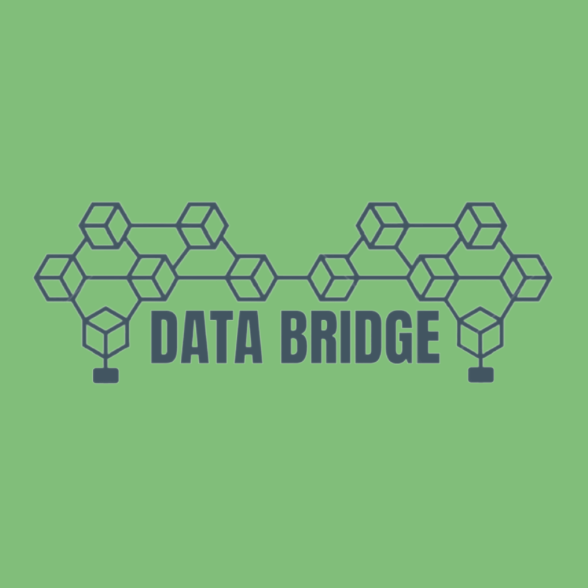

<h1>
 Welcome to DataBridge 💾🌉
</h1>

- [Youtube Demo video](https://www.youtube.com/watch?v=1scDw7K2KPU)

**Authors**
 * [nijoe1](https://github.com/nijoe1)
 * [tse-lao](https://github.com/tse-lao)

## Project Description
DataBridge: Empowering Decentralized Data Management
DataBridge is a revolutionary decentralized platform designed to empower companies and groups in managing and curating valuable datasets. By seamlessly integrating the Bacalhau server, improved dealClient contract, and new multisig features, DataBridge provides a secure and efficient solution for data collaboration, verifiable computations, and storage on the Filecoin network.

## Inspiration
Our inspiration for the DataBridge platform came from the need to revolutionize data management, collaboration, user empowerment, and low-cost permanent files in a decentralized manner. We recognized the growing demand for a secure and efficient solution to curate, collaborate, and create decentralized valuable datasets. Additionally, we saw the opportunity to bridge the gap between centralized data pools and the decentralized Filecoin network, allowing users to seamlessly onboard valuable data onto a secure and transparent platform.
## What it does?

 DataBridge is a decentralized application (DApp) designed to fulfill these needs it functions as a database aggregator. DataBridge empowers users to create decentralized databases (DBs) and request contributions from others. Once a DB reaches a predetermined threshold, the requestor can create a DB NFT. To ensure fair distribution of token minting revenues to DB contributors, our platform utilizes a splitter contract created using the thirdWeb splitter contract factory. 
 
 With DataBridge, users can leverage verifiable computations over data through the Lillypad oracle and facilitate deal-making using Filecoin proposed contracts. Onboard open datasets into IPFS and Filecoin through the DataBridge platform while maintaining your own private repository of encrypted files. Additionally, create sharable private repositories with secure access control, where only whitelisted addresses have the privilege to add files and access encrypted contents. To enhance security and efficiency, DataBridge incorporates Merkle trees for access control.

### DataBridge offers the following key improvements on HackFS:

#### Improved Bacalhau Server
The Bacalhau server has been enhanced to handle any operation within the network. It now utilizes a Lilypad-inspired architecture and integrates a contract with Tableland for decentralized SQL-based contract indexing. This integration enables users to create Job bounty requests using the newly established Oracle contract. The workflow involves describing the desired job, creating a bounty request, and receiving proposals from data scientists. The bounty creator selects the most suitable proposal, assigns it to the winner, and rewards them with the bounty. This incentivizes job creators and benefits the Bacalhau executor server, similar to Lilypad's approach.

#### Enhanced dealClient Contract
The dealClient contract now functions as a dataDAO, allowing members to request storage on the Filecoin network and replicate important files. It can handle multiple replication requests for a single file, ensuring redundancy and data availability. The contract has been integrated with a table in Tableland, simplifying access to deals published by storage providers. Additionally, it utilizes the Filecoin dataCap API to query the network and make verified deals, further enhancing data management capabilities.

- [dataDAO-dealClient-Verified](https://fvm.starboard.ventures/calibration/explorer/address/0x204ce0695260c5d3ace6626af63936beea63f17d)

#### New Multisig Features
DataBridge introduces a fully functional multi-sig wallet contract that integrates seamlessly with Tableland. This contract enables decentralized and efficient tracking of proposals and metadata. Members of the contract can manage files, create proposals, and merge database entries into a single CID at the end of each day. JSON merging is supported, facilitating collaboration and data consolidation. Companies or multisigs can convert merged DBs into NFTs, providing exclusive access to encrypted files, folders, and DBs for NFT holders. This approach allows companies to generate revenue by offering their data and provides a streamlined process for managing files, granting dataCap, and making verified deals on the Filecoin network.

DataBridge empowers users with a robust framework for securely managing and collaborating on data, conducting verifiable computations, and deriving value from shared information. The platform seamlessly integrates with Tableland, offering efficient data management and access control, while leveraging the power of the Bacalhau server and improved dealClient contract for enhanced functionality. Experience the future of decentralized data management with DataBridge.

## 🧑‍💻Technologies Used 🤖

# Bacalhau
Robust Bacalhau Oracle and Scalable Server: We designed a strong Bacalhau oracle contract supported by a scalable server infrastructure. This combination allows users to perform accurate and reliable verifiable computations on their data. The Bacalhau oracle ensures a seamless and trustworthy computation experience within the DataBridge platform.

# FEVM

Enhanced dealClient Contract and DataDAO Factory: We improved the dealClient contract and transformed it into a sophisticated dataDAO. This upgrade aligns with the evolving standards set by the Filecoin team. We integrated the dataCap API and Tableland decentralized database, which improved storage request management and made contract information more accessible. These changes take the dealClient contract to a higher level of data management.

# Lighthouse
Lighthouse plays a pivotal role in DataBridge as a robust encryption and decryption tool. It empowers users by providing a secure environment to encrypt and decrypt files using Lighthouse JWT tokens. With Lighthouse, users can onboard easily files and DBs into the platform. The backend utilizes Lighthouse to encrypt the file contents with sharing and custom access control teqniques and securely uploads the encrypted version to IPFS. DataBridge leverages Lighthouse's data depot service in the backend to retrieve all necessary file information for creating deals on Filecoin using the dealClient or dealRewarder contracts. Lighthouse ensures data confidentiality and integrity, enabling seamless file onboarding and secure storage within DataBridge.

- [useLighthouse](https://github.com/tse-lao/hackathon-fvm/blob/master/src/hooks/useLighthouse.js)
- [Lighthouse user on-boarding](https://github.com/tse-lao/hackathon-fvm/blob/master/src/pages/profile/onboarding/index.js)
- [Uploading encrypted car files](https://github.com/tse-lao/hackathon-fvm/blob/master/src/components/UploadModal.jsx)
# Tableland
Multisig Factory and Tableland Integration: To facilitate collaborative decision-making and trust verification, we developed a multisig factory within DataBridge. By leveraging Tableland, a decentralized database, we efficiently store multisig proposals and transactions in a cost-effective manner. Multisigs allow groups to securely validate and monetize valuable actions.

 - [useTableland](https://github.com/tse-lao/hackathon-fvm/blob/master/src/hooks/useTableland.js)
 - [Tableland api](https://github.com/tse-lao/hackathon-fvm/tree/master/src/pages/api/tableland)

Data Monetization and NFT Transformation: DataBridge supports data monetization through its backend system. Additionally, we offer a unique contract that enables the transformation of datasets into non-fungible tokens (NFTs). Access to decrypted data is restricted to NFT holders, providing a secure approach to data monetization.

# Polybase
Polybase integration to store all the job bounty proposals but also a mapping from the IPFS CIDs to the Filecoin needed information to make storage deals using the dealClient contract. 

- [usePolybase](https://github.com/tse-lao/hackathon-fvm/blob/master/src/hooks/usePolybase.js)
- [polybase api](https://github.com/tse-lao/hackathon-fvm/tree/master/src/pages/api/polybase)
- [FilesColection](https://explorer.testnet.polybase.xyz/studio/pk%2F0xd89cd07b2a59a0059a9001225dc6f2e27c207cc2e8df89c9f4dfcb1673f1c25b201619d55d529a0c016ea157b79abbfd26b9e57405a1de29682df4c215e32dd2%2FHACK/collections/File)
- [BacalhauJobsCollection](https://explorer.testnet.polybase.xyz/studio/pk%2F0xd89cd07b2a59a0059a9001225dc6f2e27c207cc2e8df89c9f4dfcb1673f1c25b201619d55d529a0c016ea157b79abbfd26b9e57405a1de29682df4c215e32dd2%2FHACK/collections/Jobs)
## Architecture

  
Decentralized Computation & Storage

  
  

## Smart Contracts

CONTRACT CODE  | EXPLORER
------------- | -------------
[DB.NFTs code](https://github.com/tse-lao/hackathon-fvm/blob/master/contracts/contracts/DB_NFT.sol)  | [Mumbai DB NFTs](https://mumbai.polygonscan.com/address/0x764F56e1953e4dAC1d4c02fAaa5dF3c0DE9b77a2)
[tableland.Bacalhau.Jobs code](https://github.com/tse-lao/hackathon-fvm/blob/master/contracts/contracts/tablelandBacalhauJobs.sol) | [filfoxBacalhauJobs](https://hyperspace.filfox.info/en/address/0x86D9F60d0eaCD6004a123a4F67B67d26B569Fd9C)
[tableland.Deal.Client code](https://github.com/tse-lao/hackathon-fvm/blob/master/contracts/contracts/tablelandDealClient.sol) | [filfoxDealClient](https://hyperspace.filfox.info/en/address/0xa8B737d368e46Cd98AcCa537691115C767016CC5)
[tableland.Deal.Rewarder code](https://github.com/tse-lao/hackathon-fvm/blob/master/contracts/contracts/tablelandDealRewarder.sol) | [filfoxDealRewarder](https://hyperspace.filfox.info/en/address/0xB34133c7F97Bc3B66dD41ac9e5BFB3358A587490)

- [useContract](https://github.com/tse-lao/hackathon-fvm/blob/master/src/hooks/useContract.ts)
- [postHackBranchNewVerifiedDBNFTsMumbai](https://mumbai.polygonscan.com/address/0x61981aF3ae26E43782d129288715fCF2dF7252Aa#code)

## FVM Dataverse Hackathon 2023 Submission 🚀🧑‍🚀. 

 

- [Demo video](https://www.youtube.com/watch?v=1scDw7K2KPU)
- [dapp link](https://hackathon-fvm-fj45.vercel.app/)

#### New updates from the post-hack branch
Web2 authentication has been successfully implemented  
to create a seamless onboarding experience for the masses! 🌐✨
- [post-hack-dapp-link](https://datahub-three.vercel.app/)

## 🥳 UseCase Diagrams 👀

  
Files & DBs on-boarding

  
  
  

  
Filecoin Files & DBs Deals

  
  

  
Compute Over Data

  

## 📄 License

This project is licensed under the MIT License - see the [LICENSE.md](LICENSE.md) file for details.